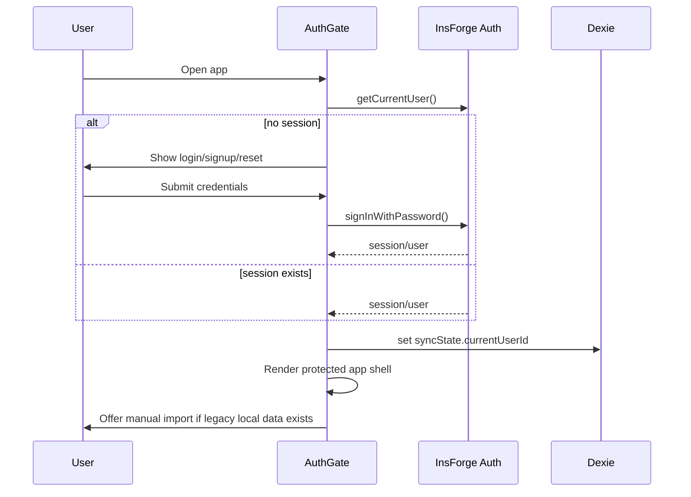
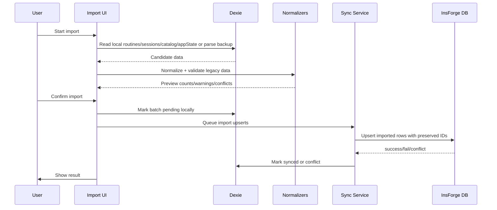
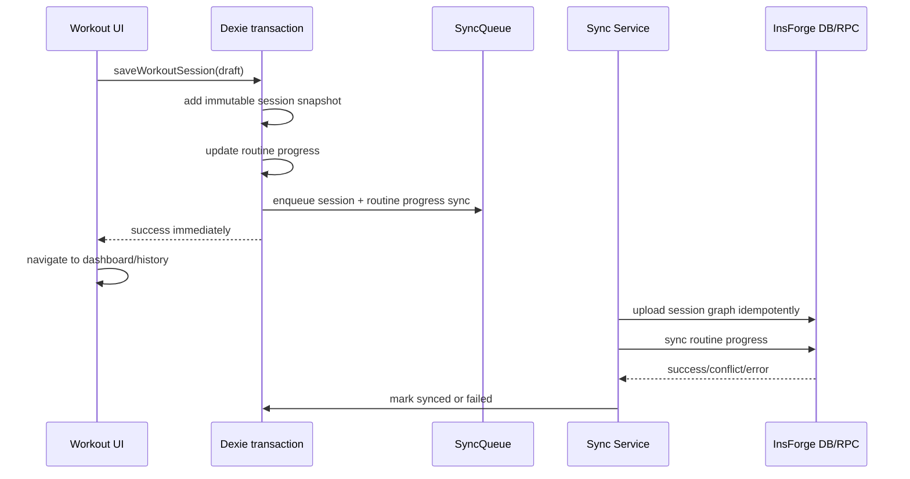

# InsForge Backend Sync — Design

**Change:** `insforge-backend-sync`
**Issue:** #64
**Phase:** design
**Status:** complete

## 1. Design Goals

Build an InsForge backend for GymTracker/Treino without sacrificing the current mobile-first workout UX.

The design optimizes for:

- mandatory authenticated ownership in v1;
- local-first runtime behavior via Dexie;
- safe manual import of existing local data;
- secure InsForge tables with RLS from the first migration;
- immutable/idempotent session snapshot sync;
- conflict-aware routine sync;
- chained PR delivery under a 400-line review budget.

## 2. Non-Goals

- No live InsForge backend mutation during this SDD planning PR.
- No OAuth/social login unless later approved. V1 assumes email/password.
- No real-time sync requirement in v1.
- No server-side analytics engine in v1.
- No remote destructive restore in v1.
- No historical session editing/deletion in v1.
- No storage buckets unless a later slice adds cloud backup files or avatars.

## 3. Target Architecture

```text
┌──────────────────────────────────────────────────────────────┐
│ React / Vite PWA                                             │
│ - Auth gate                                                  │
│ - Existing workout/routine/history/analytics UI              │
│ - Sync status UI                                             │
└───────────────────────┬──────────────────────────────────────┘
                        │ local reads/writes
┌───────────────────────▼──────────────────────────────────────┐
│ Dexie local cache                                             │
│ - existing stores: routines, sessions, exerciseCatalog, state │
│ - new sync metadata / queue                                  │
│ - remains fast and offline-capable                           │
└───────────────────────┬──────────────────────────────────────┘
                        │ background/manual sync
┌───────────────────────▼──────────────────────────────────────┐
│ InsForge SDK client                                           │
│ - VITE_INSFORGE_URL                                           │
│ - VITE_INSFORGE_ANON_KEY                                      │
│ - auth + database CRUD/RPC                                    │
└───────────────────────┬──────────────────────────────────────┘
                        │ RLS-protected API
┌───────────────────────▼──────────────────────────────────────┐
│ InsForge backend                                              │
│ - Auth users                                                  │
│ - Postgres schema + RLS                                       │
│ - optional RPC for atomic/import operations                   │
└──────────────────────────────────────────────────────────────┘
```

### Decision: local cache remains authoritative for UX

User actions write locally first. Sync reconciles local and remote state. This preserves offline workout logging and avoids blocking set entry on network latency.

### Decision: auth is mandatory before app shell

The app loads an auth gate before protected routes. Legacy local data is preserved on disk but not automatically uploaded. After login, the user chooses manual import.

## 4. Client Modules

| Module | Responsibility |
| --- | --- |
| `src/lib/insforgeClient.ts` | Create SDK client from Vite public env vars; fail safely when missing |
| `src/features/auth/*` | Login/logout/password reset/session restore |
| `src/features/sync/syncMetadata.ts` | Sync status types and helpers |
| `src/features/sync/syncService.ts` | Push/pull orchestration |
| `src/features/import/*` | Manual import preview/confirm from Dexie or JSON backup |
| Existing repositories | Continue local Dexie writes; enqueue sync work |

No frontend module may import or expose `.insforge/project.json` or API/admin keys.

## 5. Local Dexie Additions

Existing stores remain. Add a small sync layer rather than rewriting every store immediately.

### New local store: `syncQueue`

| Field | Type | Notes |
| --- | --- | --- |
| `id` | string | UUID |
| `entityType` | text | `routine`, `session`, `catalog`, `appState`, `importBatch` |
| `entityId` | string | local/client UUID or key |
| `operation` | text | `upsert`, `delete-request`, `import` |
| `status` | text | `pending`, `syncing`, `failed`, `synced`, `conflict` |
| `attempts` | number | retry count |
| `lastError` | string/null | display/debug only |
| `createdAt` | ISO string | local timestamp |
| `updatedAt` | ISO string | local timestamp |

### New local store: `syncState`

| Key | Value |
| --- | --- |
| `lastPullAt` | ISO timestamp |
| `lastPushAt` | ISO timestamp |
| `currentUserId` | auth user id |
| `importCompletedAt` | ISO timestamp/null |
| `syncPaused` | boolean |

### Entity-level metadata and local ownership

For routines, sessions, catalog entries, and app state, add optional metadata either inline or in a parallel local table:

| Field | Purpose |
| --- | --- |
| `ownerUserId` | Auth user id that owns this local row after import/sync |
| `ownershipState` | `legacy-unclaimed`, `owned`, `conflict`, or `orphaned` |
| `remoteUpdatedAt` | Last remote timestamp observed |
| `localUpdatedAt` | Local mutation timestamp |
| `syncStatus` | Current sync state |
| `syncError` | Last recoverable error |
| `remoteVersion` | Integer/version if backend exposes one |

Implementation may choose inline metadata for simplicity or a `syncMetadata` table to avoid domain pollution. The first implementation slice should prefer a separate `syncMetadata` table if it keeps domain types stable.

Authenticated app reads MUST be scoped to `ownerUserId = currentUserId` or to records explicitly selected in the manual import flow. Legacy `legacy-unclaimed` rows MUST be quarantined from normal app screens until the user imports them. This avoids showing one account another account's local cache and prevents silent account mixing after sign-out/sign-in.

## 6. InsForge Database Schema

All user-owned tables include `user_id uuid not null` and RLS. IDs use client UUIDs to preserve existing references and support idempotent upload.

### Core tables

| Table | Key fields | Notes |
| --- | --- | --- |
| `profiles` | `user_id pk`, `created_at`, `updated_at` | Optional user settings anchor |
| `app_state` | `(user_id, key)`, `value`, `updated_at` | Active routine pointer and future state |
| `exercise_catalog` | `id`, `user_id`, `name`, `normalized_name`, timestamps | Unique `(user_id, normalized_name)` |

### Routine graph

| Table | Key fields | Notes |
| --- | --- | --- |
| `routines` | `id`, `user_id`, `name`, `status`, `week_count`, progress fields, timestamps, `version` | One active routine invariant |
| `routine_weeks` | `id`, `user_id`, `routine_id`, `position`, `label` | Unique `(routine_id, position)`; composite FK `(routine_id, user_id)` to `routines` ownership |
| `routine_days` | `id`, `user_id`, `routine_id`, `week_id`, `position`, `label` | Denormalized `routine_id` for queries; composite FK `(week_id, user_id)` to parent week |
| `routine_exercises` | `id`, `user_id`, `routine_id`, `day_id`, `position`, `name`, `target_sets`, `target_rir`, `muscle` | Composite FK `(day_id, user_id)` to parent day |
| `routine_exercise_set_references` | `id`, `user_id`, `routine_exercise_id`, `set_number`, target strings | Composite FK `(routine_exercise_id, user_id)` to parent exercise |

### Session snapshots

| Table | Key fields | Notes |
| --- | --- | --- |
| `workout_sessions` | `id`, `user_id`, `routine_id`, snapshot labels, `status`, notes, start/end timestamps | Immutable after insert in v1 |
| `session_exercises` | `id`, `user_id`, `session_id`, `position`, template id/name/targets/muscle/notes | Composite FK `(session_id, user_id)` to parent session |
| `session_sets` | `id`, `user_id`, `session_exercise_id`, `set_number`, `reps`, `weight_kg`, `actual_rir` | Composite FK `(session_exercise_id, user_id)` to parent session exercise |

### Sync/import tables

| Table | Key fields | Notes |
| --- | --- | --- |
| `import_batches` | `id`, `user_id`, `source`, `status`, counts, timestamps | Manual import audit |
| `sync_conflicts` | `id`, `user_id`, `entity_type`, `entity_id`, local/remote summaries, status | Optional but useful for routine conflicts |

## 7. Indexes and Constraints

| Table | Constraint/index |
| --- | --- |
| `routines` | index `(user_id, updated_at desc)` |
| `routines` | index `(user_id, status)` |
| `routines` | partial unique active routine per user where `status='active'` if supported |
| `routine_weeks` | unique `(routine_id, position)` |
| `routine_days` | unique `(week_id, position)` |
| `routine_exercises` | unique `(day_id, position)` |
| `routine_exercise_set_references` | unique `(routine_exercise_id, set_number)` |
| `exercise_catalog` | unique `(user_id, normalized_name)` |
| `workout_sessions` | index `(user_id, ended_at desc)` |
| `workout_sessions` | index `(user_id, routine_id, day_id, ended_at desc)` |
| `session_exercises` | unique `(session_id, position)` |
| `session_sets` | unique `(session_exercise_id, set_number)` |

## 8. RLS Policy Matrix

| Table group | SELECT | INSERT | UPDATE | DELETE |
| --- | --- | --- | --- | --- |
| profiles/app_state | own rows only | own rows only | own rows only | own rows only |
| routines graph | own rows only | own rows only | own rows only | no hard delete in v1, or own rows only if enabled |
| exercise_catalog | own rows only | own rows only | own rows only | own rows only |
| workout_sessions graph | own rows only | own rows only | disallow in v1 except sync metadata if split | disallow in v1 |
| import_batches | own rows only | own rows only | own rows only | no delete in v1 |
| sync_conflicts | own rows only | own rows only | own rows only | own rows only |

Policy shape:

```sql
USING (user_id = auth.uid())
WITH CHECK (user_id = auth.uid())
```

For child tables, v1 stores `user_id` directly to keep policies simple and avoid recursive policy pitfalls. Child-table integrity MUST also prevent cross-user parent references. Use composite uniqueness/FKs such as `UNIQUE(id, user_id)` on parent tables and child FKs like `(parent_id, user_id) REFERENCES parent(id, user_id)`, or use equivalent parent-ownership `WITH CHECK` policies/RPCs. RLS smoke tests MUST include an authenticated user attempting to insert a child row with their own `user_id` but another user's parent UUID; that attempt MUST fail.

## 9. Auth/Login Flow



Sign-out keeps local data but disables protected app access until login. Manual import remains explicit after re-login.

## 10. Manual Import Sequence

Sources:

1. Existing Dexie stores on the device.
2. Existing local JSON backup file.



Rules:

- Import never silently deletes remote data.
- Existing remote rows with same IDs or conflicting active routine state produce preview/conflict handling.
- Legacy normalizers remain in use for missing muscles, set references, stale progress, and session field compatibility.

## 11. Sync Strategy

### Push order

1. Exercise catalog.
2. Routine graph.
3. App state/active routine.
4. Workout sessions graph.
5. Import batch status/conflicts.

### Pull order

1. App state/profile.
2. Exercise catalog.
3. Routine graph.
4. Session graph.
5. Conflicts/import status.

### Conflict policy

| Entity | Policy |
| --- | --- |
| sessions | Append-only/idempotent. Same ID means same session; divergent same ID is conflict. |
| routines | Detect concurrent local/remote edits using version/update timestamp. Prompt user. |
| catalog | Upsert by normalized name; remote latest display name wins unless local dirty. |
| app_state active routine | Account-wide remote state wins after sync, but local conflict is surfaced. |

Routine conflict UX options:

- keep local and overwrite remote;
- keep remote and discard local dirty version;
- duplicate local as copy.

No silent auto-merge in v1.

## 12. Session Save/Sync Strategy

Session completion stays local-first:



If backend is source for progress convergence, use either:

- a Postgres RPC for atomic remote session insert + progress update; or
- deterministic client upload order with recovery.

Design preference for v1: keep local atomic save; sync session append-only; sync routine progress with conflict detection.

## 13. Backup/Restore Strategy

- Local JSON export remains supported.
- Local JSON restore remains destructive to local cache only after confirmation.
- Restore does not automatically overwrite remote data.
- After local restore, user may manually import/sync restored data.
- A future cloud backup feature may store backup files in private InsForge storage, but that is out of v1.

## 14. Environment and Deployment Plan

Required local/documented env vars:

```text
VITE_INSFORGE_URL=<insforge oss_host for the target environment>
VITE_INSFORGE_ANON_KEY=<anon key from InsForge secrets>
```

Implementation tasks must add `.env.example` but never commit `.env` or secret values.

InsForge operations:

- Use `npx @insforge/cli`, never global install.
- Verify auth/project:
  - `npx @insforge/cli whoami`
  - `npx @insforge/cli current`
  - `npx @insforge/cli metadata --json`
- Fetch/inspect migrations before writing new ones.
- Use backend branch for schema/RLS where available.
- If branch unavailable, stop for explicit user decision.

## 15. Migration Plan

1. Create backend branch: `backend-sync` with schema-only mode if available.
2. Inspect existing schema, policies, functions, migrations.
3. Create migrations directory and first schema migration.
4. Add core tables and constraints.
5. Add RLS policies.
6. Add optional RPCs only if needed by implementation slice.
7. Apply to backend branch.
8. Run RLS smoke tests.
9. Dry-run branch merge and save SQL.
10. Merge branch only after review and approval.

No migration should include `BEGIN`/`COMMIT`; InsForge manages migration transactions.

## 16. Rollback Plan

| Layer | Rollback |
| --- | --- |
| SDD artifacts | Revert OpenSpec PR |
| SDK/env foundation | Revert PR; app remains Dexie-only |
| Auth gate | Revert auth PR; local app resumes current behavior |
| Schema/RLS branch | Delete/reset InsForge backend branch before parent merge |
| Parent backend schema | Use saved schema export and migration rollback plan; avoid destructive changes in v1 |
| Sync failures | Disable sync UI/service; keep local Dexie data intact |
| Import failure | Mark import batch failed; local source remains untouched |

## 17. Validation Plan

### Code validation

- `npm run lint`
- `npm run typecheck`
- `npm run test:run`
- `npm run test:e2e`

### Backend validation

- `npx @insforge/cli current`
- `npx @insforge/cli metadata --json`
- `npx @insforge/cli db migrations list`
- migration apply on backend branch
- table/index/policy inspection
- RLS tests:
  - unauthenticated cannot read/write user rows
  - user A cannot read/write user B rows
  - user can CRUD own allowed rows
- session idempotency test
- import preview and conflict test

### Manual smoke

- Login/signup/reset.
- Manual import from legacy local data/backup.
- Create/edit/activate routine.
- Start and finish workout offline and online.
- Confirm history and analytics show synced sessions.
- Sign out/in and verify local cache behavior.
- Confirm no admin/API key appears in frontend bundle or repo diff.

## 18. Chained PR Slices

| PR | Slice | Target budget | Notes |
| --- | --- | ---: | --- |
| 0 | SDD artifacts | docs only | Current planning PR |
| 1 | SDK/env/auth scaffolding | ≤400 | install SDK, env example, auth client shell tests |
| 2 | InsForge schema/RLS migrations | ≤400 | migrations only, backend branch validation |
| 3 | Login gate UX | ≤400 | auth pages/router gate/session restore |
| 4 | Local sync metadata foundation | ≤400 | Dexie metadata/queue, no remote writes yet |
| 5 | Manual import preview/confirm | ≤400 | from Dexie/backup into queue/remote |
| 6 | Routine sync | split if needed | graph serialization, active routine convergence |
| 7 | Session snapshot sync | split if needed | idempotent upload/pull, previous refs |
| 8 | History/analytics sync integration | split if needed | include remote pulled data in local cache |
| 9 | Backup/copy/sync status polish | ≤400 | UX copy, status indicators, runbook |

If any slice exceeds 400 changed lines, split before opening PR.

## 19. Tradeoffs

| Choice | Benefit | Cost |
| --- | --- | --- |
| Local-first sync | Preserves workout UX/offline behavior | More complexity than online-first |
| Relational schema | RLS/indexes/future analytics | More mapping code than JSON blobs |
| Mandatory login | Clean ownership model | Requires auth UX before app use |
| Manual import | Avoids silent data mixing | More user friction |
| No realtime v1 | Simpler, safer | Cross-device updates are not instant |

## 20. Phase Result

```yaml
status: complete
executive_summary: Design defines a secure local-first InsForge sync architecture: mandatory auth gate, Dexie cache, relational user-owned schema, RLS-first policies, manual import, conflict-aware routine sync, immutable session sync, and chained implementation slices.
artifacts:
  - openspec/changes/insforge-backend-sync/design.md
next_recommended: tasks
risks:
  - auth provider details still need final confirmation before auth PR
  - backend branch availability must be verified before schema apply
  - conflict UX is designed at policy level but will need careful UI execution
  - relational mapping may require splitting routine/session sync into multiple PRs
skill_resolution: injected
```
